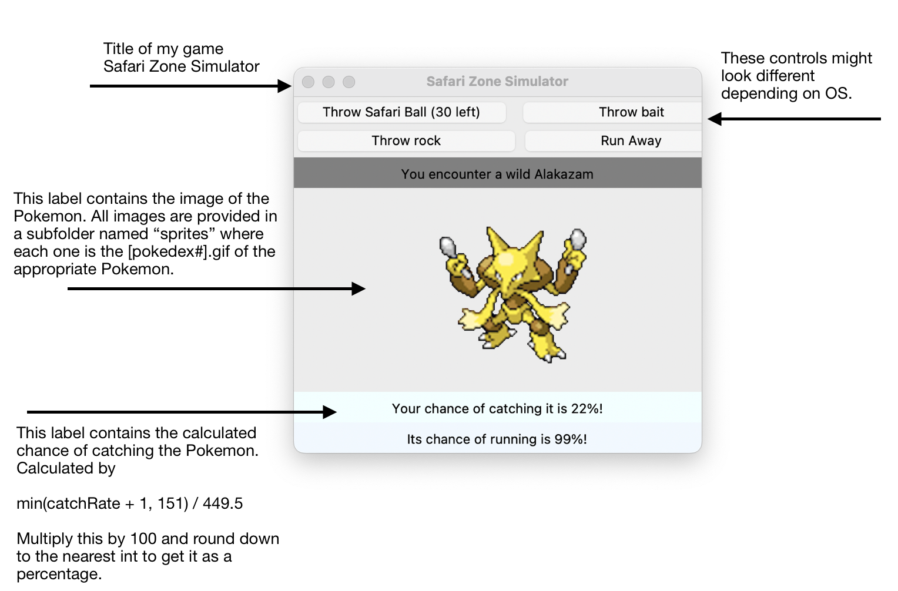

# Safari Zone Simulator

A simple Pokemon video game written in Python Programming Language.

## How to Run the Code
To play the video game you will need the files PokemonGame.py, pokedex.csv, and the directory sprites. Feel free to obtain them through pull requests or more primitive means such as downloading/copy pasting. Once you obtain the necessary source materials open a terminal and navigate to the directory where your files are stored (keep all the files and the sprites folder in the same directory), and run the following command 
 python3 PokemonGame.py   
This should run the video game. If you are using an older version of python you might need to use the below command instead.
  python PokemonGame.py

Although it is highly reccomended you update to the latest version of Python for the best results. If this still doesn’t work refer to the file dependecies.txt. After running the above command the program should compile and run to display the following result. The exact look might vary slightly based on platform architecture, python version, etc… 

## Instructions for the Gameplay

This is a small subset of a more advanced Pokemon Game in which users have a set number of Safari balls to catch as many Pokemon as possible. There are no battles within the minigame, so the user has the following options for each turn.

1. Throw a Safari ball.
2. Run away (and find another pokemon).
3. Throw a rock at the pokemon. This increases the chance of capture but also increases the chance that the Pokemon will run away on its turn.
4. Throw bait at the Pokemon which decreases the chance of capture, but also decreases the chance the Pokemon will run away.

At the start of each game the user starts with 30 safari balls. The program keeps track of the number of balls used, and the game is over when the counter reaches 0.
The program also keeps track of all captured Pokemon, and reports them to the user at the end. Currently there are 151 "species" of Pokemon each with different images, names, and catch probabilities.
The probability that a random Pokemon will be caught can be determined using this formula  
min((catchRate + 1), 151) / 449.5. Where catch rate is the Pokemons catchRate from the .csv file. A schematic of the GUI for the game is below.

